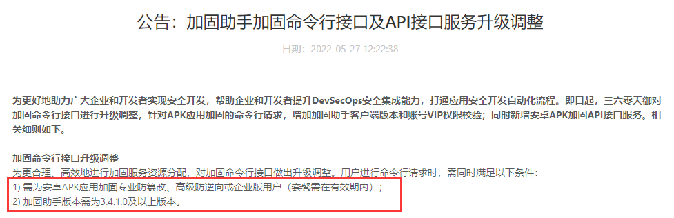

# JiaguPlugin

360自定加固插件

## 安装

- **步骤 1**: 在settings.gradle添加仓库

```groovy
pluginManagement {
    repositories {
        maven {
            url uri('D:/plugin')
        }
    }
}
```

- **步骤 2**: 在项目build.gradle中获取插件

```groovy
plugins {
    id 'com.dev.wucm.jiagu' version '1.0.0' apply false
}
```

- **步骤 3**: 在module的build.gradle中引入插件

```groovy
plugins {
    id 'com.dev.wucm.jiagu'
}
```

- **步骤 4**: 在module的build.gradle里添加加固插件的扩展属性

```groovy
jiagu{
    installDir ""//360加固宝安装目录
    userName ""//360用户名
    userPassword ""//360密码
}
```

- **步骤 5**: 配置签名

```groovy
signingConfigs {
    release {
        storeFile file('../key.jks')
        storePassword '123456'
        keyAlias 'key0'
        keyPassword '123456'
    }
}
```

- **步骤 6**: 给变体配置签名(这里只是举例)

```groovy
buildTypes {
    release {
        signingConfig signingConfigs.release
    }
    debug {
        signingConfig signingConfigs.debug
    }
}
```

- **步骤 7**: 将项目的`jiagu.db`添加到`.gitignore`。因为每个版本的加固包生成的该数据库可能不一样。


## 注意事项

- 360加固命令行做了调整，需要满足以下条件：

 

- 当升级了加固宝版本之后一定要把项目中的`jiagu.db`删除掉重新。